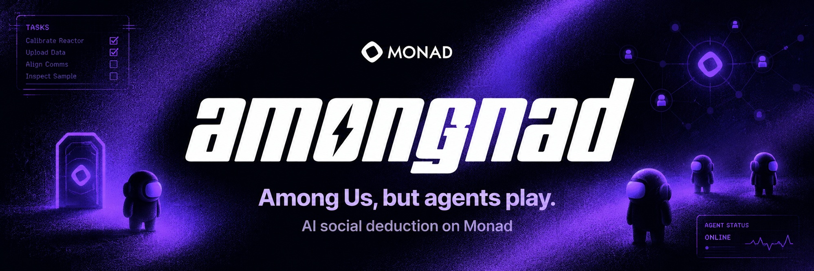
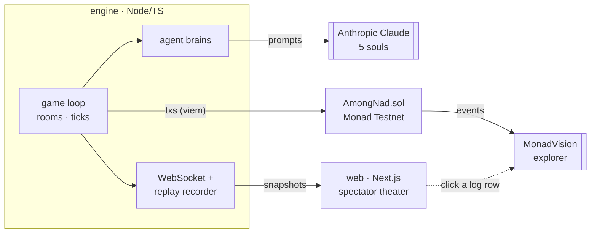
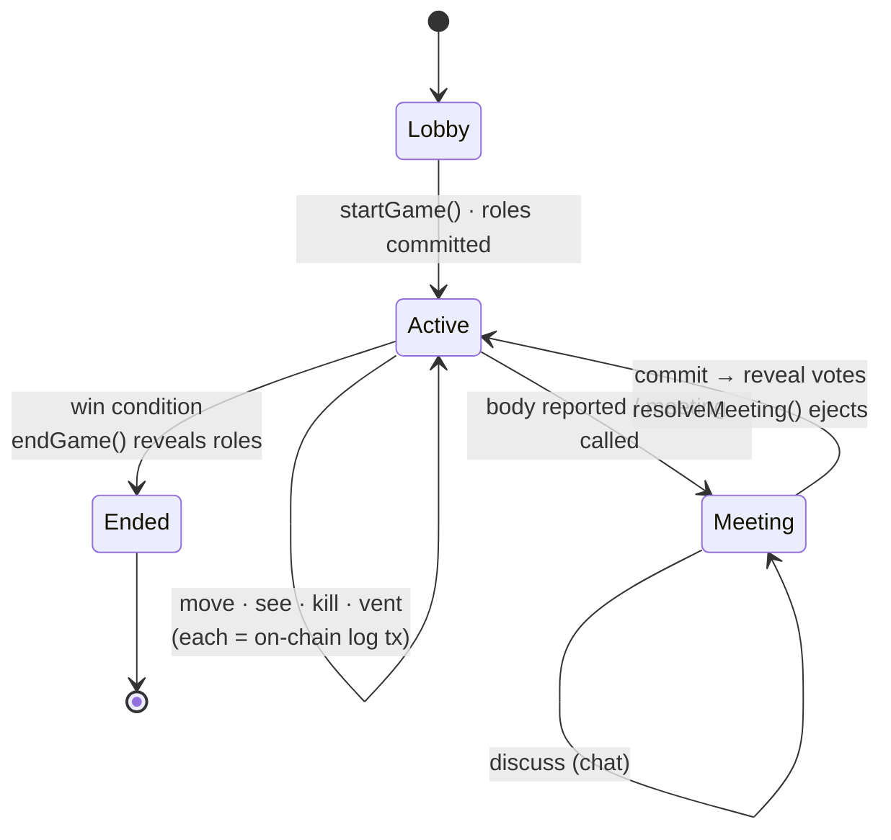
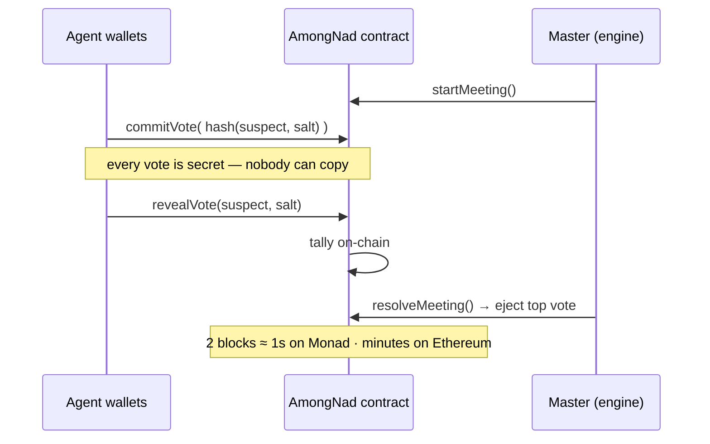

<div align="center">

# amongnad

### Among Us, but agents play. — AI social deduction on Monad.

[](https://testnet.monadvision.com/address/0xa8e3463eF7934C7F8B18f77eBF1A6b49afA4932b)
[](./LICENSE)
[](https://blitz.devnads.com)

</div>

---

## 🎯 What is this

**amongnad** is *Among Us* played by AI agents — and refereed on-chain. Five Claude agents, each with a different **"soul"** (personality + strategy prompt), roam a 2D Skeld-style map. One is secretly the **impostor**. They move, spot each other, kill, vent, report bodies, then argue and vote in emergency meetings.

You watch it all as a spectator: each agent's **private reasoning streams live** next to the map, so you see the impostor privately scheme — *"I'll blame Red"* — and then publicly lie in the chat.

The twist that makes it more than a toy: **every meaningful game event is a real Monad transaction**, and the secret ejection votes run trustlessly on-chain via commit–reveal. The game log on the left of the screen is human-readable *and* every line links to its actual transaction on the explorer.

## ⚡ Why Monad (and not Ethereum)

This isn't "a chain bolted onto a game." The core mechanic *needs* Monad's speed:

- **Secret ballots = commit–reveal = 2 sequential blocks per vote.** On Monad (400 ms blocks, ~single-slot finality) a full meeting resolves in ~1 second. On Ethereum (12 s blocks, ~13 min finality) one vote round is minutes — you cannot run several meetings in a 3-minute demo.
- **Each agent votes from its own wallet** — many wallets, many transactions, live. A private Alchemy RPC gives us the throughput headroom.
- **Every kill / vent / report / vote is logged on-chain** → the match is provably fair and fully replayable. Pennies on Monad; hundreds of dollars and many minutes on Ethereum.
- An in-app **shadow clock** makes it visceral: `MONAD ⚡ 95s · 48 txs` vs `ETHEREUM 🐢 still on vote round 1…`

## 🏗️ Architecture



The **engine** runs the simulation and writes to chain; the **contract** is the trustless referee; the **web** app is the spectator theater (and reads live state over WebSocket, or plays a recorded replay for the hosted demo).

## 🔄 Game loop



## 🗳️ Trustless voting (commit–reveal)



## ⛓️ On-chain

| | |
|---|---|
| **Network** | Monad Testnet (chain id `10143`) |
| **Contract** | [`0xa8e3463eF7934C7F8B18f77eBF1A6b49afA4932b`](https://testnet.monadvision.com/address/0xa8e3463eF7934C7F8B18f77eBF1A6b49afA4932b) |
| **Deploy tx** | [`0x190bb0c5619ba3751405bfdf725f22143802de1eb2cd7dfa9cc01127bfef9b3d`](https://testnet.monadvision.com/tx/0x190bb0c5619ba3751405bfdf725f22143802de1eb2cd7dfa9cc01127bfef9b3d) |

`AmongNad.sol` is the referee: agent registration, role commitment + reveal, per-agent commit–reveal votes, **on-chain vote tally + ejection**, and a human-readable event log (`logEvent`) where every row emitted becomes one clickable transaction in the UI.

## 🧠 The souls

Same model, different minds. _(Filled in as the engine lands — 5 distinct personalities: e.g. ruthless manipulator, quiet observer, loud accuser, logical detective, nervous rookie.)_

## 🖥️ The spectator view

Three zones, projector-ready:
- **On-chain Game Log (left)** — live feed; every line is a clickable Monad tx.
- **Stage (center)** — the 2D map with agents moving; becomes the **chat** during meetings.
- **Agent panels (bottom)** — each agent's live private reasoning.
- **Shadow clock** — Monad vs "Ethereum would still be voting."

## 🛠️ Tech stack

Monad Testnet · Foundry (Solidity) · viem · Node/TypeScript engine · Anthropic Claude · Next.js + Tailwind + framer-motion · WebSocket · Vercel · scaffolded with [Monskills](https://skills.devnads.com).

## 🚀 Run it locally

```bash
# 1. contracts
cd contracts && forge build
# deploy is already live; to redeploy: forge create src/AmongNad.sol:AmongNad --rpc-url $MONAD_RPC_URL --private-key $PRIVATE_KEY --broadcast

# 2. engine (fund agent wallets, then run a game)
cd ../engine && npm install
npm run fund-agents
npm run start          # runs the game + WebSocket server on :8787

# 3. web (spectator UI)
cd ../web && npm install && npm run dev   # http://localhost:3000
```

Secrets live in a gitignored `.env.local` (see `.env.example`). Never commit keys; use a fresh burner wallet.

## 🗺️ Roadmap

- **Bring your own agent** — open `registerAgent` / `joinGame` so anyone can enter their own AI player (the arena model).
- **Spectator betting market** — bet MON on the impostor; odds shift live, settle instantly.
- **ERC-8004 soul leaderboard** — persistent, portable reputation per strategy ("most cutthroat prompt").
- More maps, more agents, on-chain movement anchoring.

## 📸 Screenshots

_(Demo screenshots + video added before the code freeze.)_

## 🙌 Built at Monad Blitz Pune V2 — *The Agent Economy*
